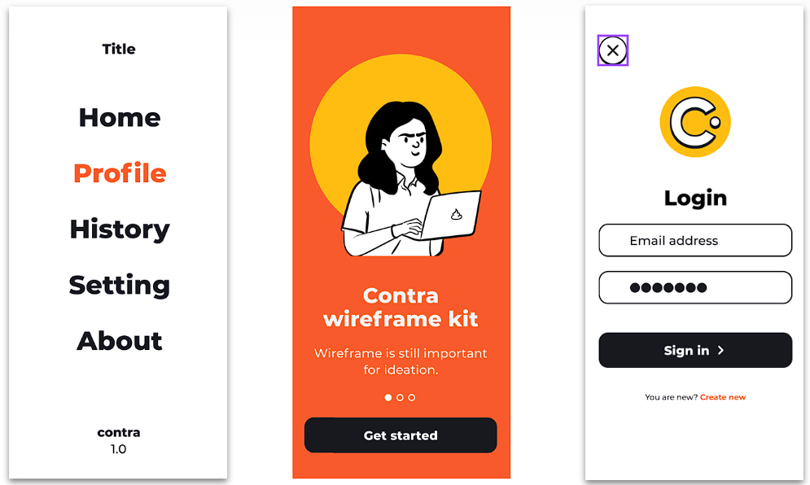

# Ejercicio: Creación de Vistas

En este ejercicio, el objetivo es crear una serie de vistas según las imágenes proporcionadas en la carpeta "assets". Se han definido las siguientes especificaciones para el ejercicio:

## Vistas a Crear

   - 

## Recursos

En la carpeta "assets" encontrarás las imágenes necesarias para completar las vistas.

## Documentación y Guía

Para desarrollar las vistas, se recomienda seguir los siguientes pasos:

1. **Organización del Equipo**: Se sugiere trabajar en equipo, donde todos se ayuden mutuamente. Otra estrategia efectiva puede ser compartir pantalla y discutir los problemas juntos.

2. **Fuentes y Colores**: Utiliza la fuente ["Montserrat"](https://fonts.google.com/specimen/Montserrat?query=montserrat) con un grosor de 700, para el texto. Los colores principales a utilizar son:
   - #F95A2C
   - #FFBD12

> [!TIP]
> Utiliza propiedades de CSS como `color`, `border`, `border-radius`, `background-color` y ten en cuenta el `modelo de caja` para llegar al resultado deseado, puedes revisar los [artículos](#artículos-útiles) listados más abajo.

> [!IMPORTANT]
> Aunque las vistas esten en un formato vertical, esto no es necesario, llega a un resultado similar de forma horizontal.

3. **Avance Progresivo**: No es necesario completar todas las vistas de una vez. Avanza según puedas y considera lo que falte para practicar más adelante.

4. **Práctica y Experimentación**: No dudes en experimentar con diferentes estilos y técnicas de diseño para mejorar tus habilidades.

## Artículos útiles

   - https://web.dev/learn/css?hl=es
   - https://keepcoding.io/blog/como-usar-google-fonts-con-css/
   - https://developer.mozilla.org/es/docs/Learn/CSS/Building_blocks/The_box_model
   - https://dev.to/lupitacode/que-es-el-box-model-4mnj
   - https://www.freecodecamp.org/news/css-box-model-explained-with-examples/
   - https://htmlcolorcodes.com/es/
   - https://www.mclibre.org/consultar/htmlcss/css/css-color.html
   - https://www.w3schools.com/css/css_border.asp