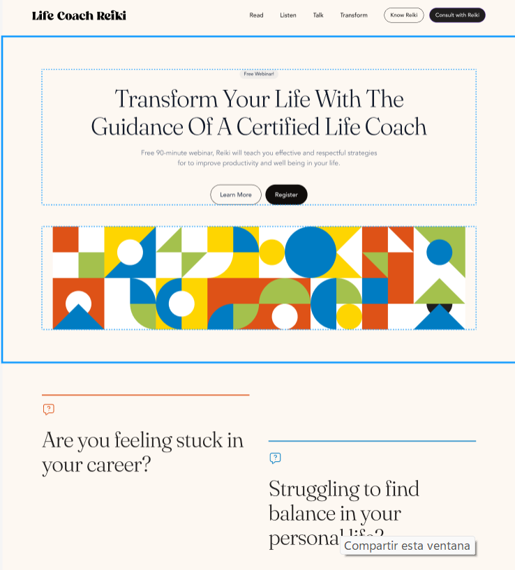

# README - Proyecto de Desarrollo de Landing Page

Este repositorio contiene los recursos necesarios para emepzar a desarrollar una landing page.

## Objetivo
El objetivo principal de este proyecto es desarrollar la estructura de una landing page basada en la imagen mostrada. Al haber identificado la posible estructura el siguiente paso es desarrollar la landing page.

## Desarrollo
El desarrollo de la landing page se llevará a cabo siguiendo estos pasos:

1. **Estructura en HTML**: Crear la estructura básica de la landing page utilizando HTML. Esto incluirá la disposición de los elementos según la imagen proporcionada.

2. **Estilización con CSS**: Utilizar CSS para agregar colores, tipos de fuente y cambiar el tamaño de los elementos de acuerdo con el diseño de la imagen. Además, se utilizarán los assets de las imágenes proporcionadas en este repositorio para darle estilo a la página. Utiliza Flexbox y el modelo de caja para llegar a los resultados. 

> [!TIP]
> Considera ir sección a sección, no es necesario que desarrolles toda la landing, el objetivo es que mejores tus habilidades con la práctica.

## Recursos
- La plantilla completa la encontraras en este [Link](https://www.figma.com/file/dnV9CxIKPvpMNcJHurF7gc/Simple-and-Calm-Webinar-Landing-Page-Template-(Community)?type=design&node-id=1%3A16061&mode=design&t=t04FCDygtiJOpHG3-1), puedes usarla como referencia.
- Se proporcionan los assets de las imágenes necesarias en este repositorio.
- Se utilizarán HTML y CSS para el desarrollo de la landing page.
- Colores Utilizados
    - #A4C14D
    - #FED501
    - #000000
    - #FFFFFF

## Links Útiles
Aquí se encuentran algunos enlaces útiles que pueden ayudar en el desarrollo del proyecto:

- [Documentación de HTML](https://developer.mozilla.org/es/docs/Web/HTML)
- [Documentación de CSS](https://developer.mozilla.org/es/docs/Web/CSS)
- [Como usar Google fonts](https://keepcoding.io/blog/como-usar-google-fonts-con-css/)
- [Colores CSS](https://www.mclibre.org/consultar/htmlcss/css/css-color.html )
- [Colores Hexadecimales](https://htmlcolorcodes.com/es/)
- [CSS Reference](https://cssreference.io/)
- [Modelo de Caja](https://dev.to/lupitacode/que-es-el-box-model-4mnj )
- [Borde CSS](https://www.w3schools.com/css/css_border.asp )
- [Flexbox](https://www.meltstudio.co/post/conceptos-y-ejemplos-practicos-de-css-flexbox-guia-en-espanol-parte-1 )
- [Flexbox Handbook](https://www.freecodecamp.org/news/the-css-flexbox-handbook/ )
- [Video Introductorio CSS](https://www.youtube.com/watch?v=3yM5uXp-T_0&pp=ygURZ3XDrWEgZXN0aWxvcyBjc3M%3D)