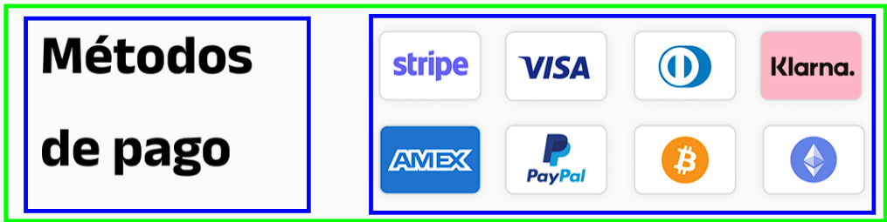

# README - Proyecto de Desarrollo de Section con Flexbox

## Objetivo
El objetivo principal de este proyecto es desarrollar una pequeña section que pueda ir en una landing page.

## Desarrollo
El desarrollo se llevará a cabo siguiendo estos pasos:

1. **Estructura en HTML**: Crear la estructura básica de la landing page utilizando HTML. Esto incluirá la disposición de los elementos según la imagen proporcionada, no utilices los bordes azules y verde, solo son referenciales

2. **Estilización con CSS**: Utilizar CSS para agregar colores, tipos de fuente y cambiar el tamaño de los elementos de acuerdo con el diseño de la imagen. Utiliza los assets de las imágenes proporcionadas en este repositorio para darle estilo. Utiliza Flexbox y el modelo de caja para llegar a el resultado

> [!TIP]
> Ten en cuenta las propiedades de flexbox a utilizar y recuerda que estan se aplican a un elemento padre. Considera la propiedad `flex-wrap` y agrega propiedades como padding del modelo de caja para llegar al resultado.

## Recursos
- Las imagenes las encontrarás en `assets`

## Links Útiles
Aquí se encuentran algunos enlaces útiles que pueden ayudar en el desarrollo del ejercicio:

- [CSS Reference](https://cssreference.io/)
- [Modelo de Caja](https://dev.to/lupitacode/que-es-el-box-model-4mnj )
- [Borde CSS](https://www.w3schools.com/css/css_border.asp )
- [Flexbox](https://www.meltstudio.co/post/conceptos-y-ejemplos-practicos-de-css-flexbox-guia-en-espanol-parte-1 )
- [Flexbox Handbook](https://www.freecodecamp.org/news/the-css-flexbox-handbook/ )
- [flex-wrap](https://www.w3schools.com/cssref/playdemo.php?filename=playcss_flex-wrap)