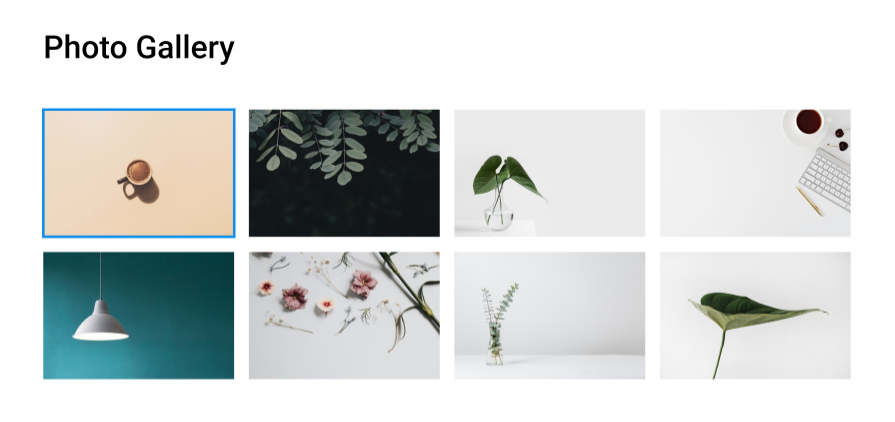

# README - Proyecto de Desarrollo de Galería con Grid

## Objetivo
El objetivo principal de este proyecto es desarrollar una pequeña galería que puede ser parte de un sitio

## Desarrollo
El desarrollo se llevará a cabo siguiendo estos pasos:

1. **Estructura en HTML**: Crear la estructura básica de la landing page utilizando HTML. Esto incluirá la disposición de los elementos según la imagen proporcionada, no utilices los bordes azules y verde, solo son referenciales

2. **Estilización con CSS**: Utilizar CSS para agregar colores, tipos de fuente y cambiar el tamaño de los elementos de acuerdo con el diseño de la imagen. Utiliza los assets de las imágenes proporcionadas en este repositorio para darle estilo. Utiliza Grid estableciendo una grilla de 4 x 2.

> [!TIP]
> Ten en cuenta las propiedades de Grid y establecer template-colums y template-rows, para separar los elementos es necesario utilizar la propiedad gap.

## Recursos
- Las imagenes las encontrarás en `assets`

## Links Útiles
Aquí se encuentran algunos enlaces útiles que pueden ayudar en el desarrollo del ejercicio:

- [CSS Reference](https://cssreference.io/)
- [Web Dev grid](https://web.dev/learn/css/grid?hl=es-419)
- [Guía completa grid](https://css-tricks.com/snippets/css/complete-guide-grid/)
- [Guía ilustrada grid](https://dev.to/mustapha/css-grid-illustrated-introduction-52l5 )

