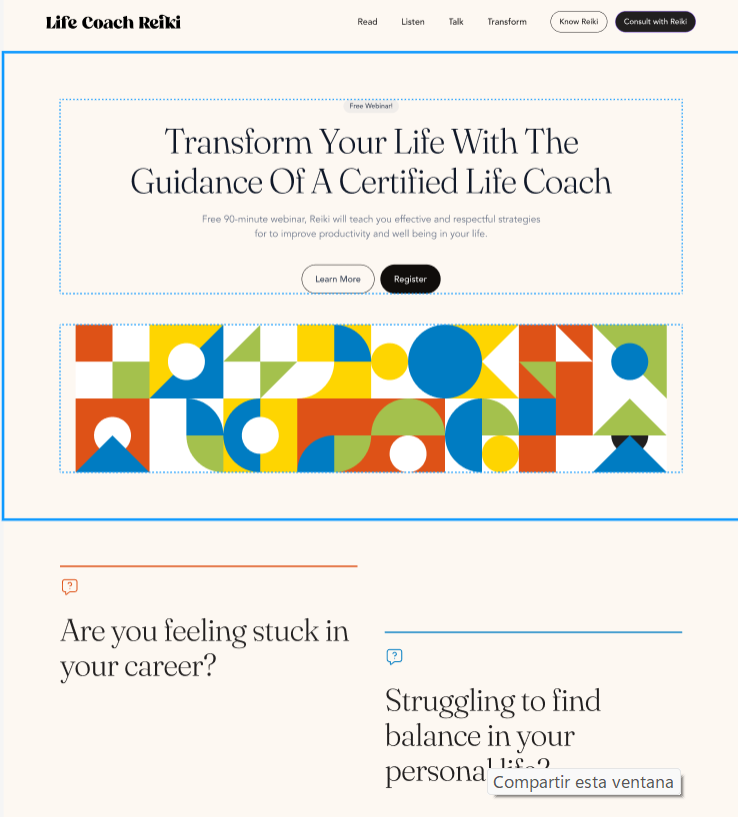

# README - Proyecto de Desarrollo de Landing Page

Este repositorio contiene los recursos necesarios para emepzar a desarrollar una landing page.

## Objetivo
El objetivo principal de este proyecto es desarrollar la estructura de una landing page basada en la imagen mostrada. Se espera identifiques la posible estructura de la landing a partir de la imagen suministrada.

## Desarrollo
El desarrollo de la landing page se llevará a cabo siguiendo estos pasos:

1. **Estructura en HTML**: Crear la estructura básica de la landing page utilizando HTML. Esto incluirá la disposición de los elementos según la imagen proporcionada.

2. **Estilización con CSS**: Utilizar CSS para agregar colores, tipos de fuente y cambiar el tamaño de los elementos de acuerdo con el diseño de la imagen. Además, se utilizarán los assets de las imágenes proporcionadas en este repositorio para darle estilo a la página.

## Recursos
- Se proporcionan los assets de las imágenes necesarias en este repositorio.
- Se utilizarán HTML y CSS para el desarrollo de la landing page.
- Colores Utilizados
    - DD5217
    - DD5217

> [!IMPORTANT]
> No es necesario que quede como la imagen mostrada, define la estructura y has cambios en la fuente el tamaño para ir acercandote al resultado. Prioriza la estructura HTML y utilizar selectores y propiedades de CSS.

## Links Útiles
Aquí se encuentran algunos enlaces útiles que pueden ayudar en el desarrollo del proyecto:

- [Documentación de HTML](https://developer.mozilla.org/es/docs/Web/HTML)
- [Documentación de CSS](https://developer.mozilla.org/es/docs/Web/CSS)
- [Como usar Google fonts](https://keepcoding.io/blog/como-usar-google-fonts-con-css/)
- [Colores Hexadecimales](https://htmlcolorcodes.com/es/)
- [CSS Reference](https://cssreference.io/)